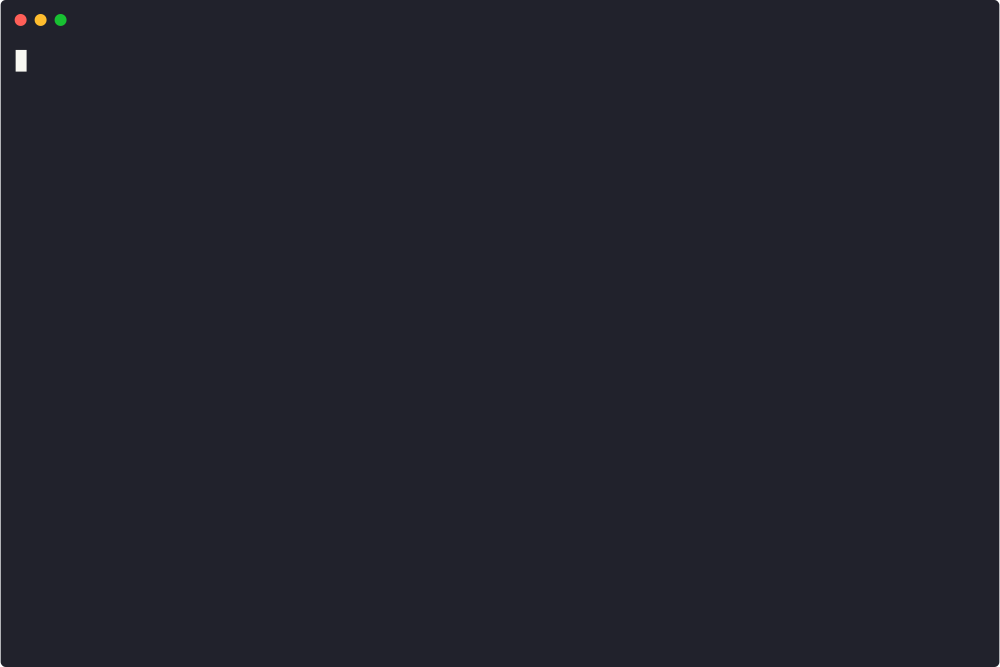

# Origami

[](https://www.python.org/)
[](LICENSE)
[](https://github.com/thezakman/Origami/actions/workflows/tests.yml)
[](https://github.com/thezakman/Origami/commits/main)
[](https://github.com/thezakman/Origami/stargazers)

> Adaptive content discovery engine that **folds its strategy around the target's behavior, technology and response patterns.**

Origami is an evolution of `ffuf`/`dirb`: instead of brute-forcing blindly, it **calibrates before attacking**, fingerprints the stack (additively, per path-prefix), and then *folds* its strategy as evidence appears — by header, cookie, response, directory or file. Every finding becomes evidence that re-weights the modules and expands the wordlist in real time. With each run it also learns across targets.

```
   /\                                 .
  /  \        .                      /_\
 / /\ \  _ __ _  __ _  __ _ _ __ ___  _
/_/  \_\| '__| |/ _` |/ _` | '_ ` _ \| |
\ \  / /| |  | | (_| | (_| | | | | | | |
 \ \/ / |_|  |_|\__, |\__,_|_| |_| |_|_|
  \  / adaptive |___/ content discovery
   \/
```

## Why it's different

Blind brute-forcers (`ffuf`, `dirb`, `dirsearch`) fire one fixed wordlist at every target, bury you in soft-404 noise, and ignore everything the app reveals about itself. **Origami exists to make content discovery *adaptive*** — it calibrates to the target, fingerprints the stack, and folds its strategy around the evidence, so it finds more with fewer requests. Six ideas set it apart:

1. **Calibrate before attacking.** A per-context soft-404 profile — per directory *and* extension class, over a normalized-body **simhash** — means CSRF tokens, nonces, timestamps and WAF support-IDs never masquerade as hits.
2. **Fingerprint additively, fold per-prefix.** Every path-prefix carries its own evidence-weighted stack fingerprint; confirming a technology folds in *its* extensions, paths and modules (IIS → `.aspx` + shortscan; PHP/Laravel/Django/… → their own packs).
3. **Discovery compounds.** It reads the target's own code — JS, API specs, robots, headers, archives — then re-reads every file *it* uncovers and recurses the directories they live in. The more it finds, the more it finds.
4. **Reads content, not just status codes.** Response bodies are mined for credentials, information-disclosure leaks, and reflected parameters graded by injection context — it tells you *what leaked*, not just a wall of `200`s.
5. **Stays alive under a WAF.** Per-context calibration, AIMD backoff, honored `Retry-After`, UA/proxy rotation and a learned request-economy bandit keep it under the radar and spend a tight budget on the hits most likely to land.
6. **Gets smarter every run.** A SQLite corpus, k-NN over fingerprint vectors and a character n-gram completer prime each new scan from everything past ones turned up.

## Demo

A real run against the test target — fingerprint, findings streaming live, a **403 → 200 bypass**, and a leaked **`.env`** (AWS key + DB URI + an internal-host leak):



## Install

Requires **Python 3.11+**.

```bash
git clone https://github.com/thezakman/Origami
cd Origami
python3.11 -m venv .venv
.venv/bin/pip install -e .
```

This installs the `origami` command into the venv (with `rich` for the live dashboard). Or run without installing: `PYTHONPATH=. python3 -m origami ...`. For HTTP/2 support (`--http2`) also install the optional extra: `.venv/bin/pip install -e '.[http2]'`.

## Usage

```bash
origami https://example.com                 # scan one target
origami https://example.com/app/            # scan under a base path
origami -l targets.txt --out results/       # scan a list, artifacts per host
```

Common flags:

| flag | meaning |
|---|---|
| `-w FILE` | wordlist (default: curated ~340-word builtin; point at SecLists/Assetnote for exhaustive runs) |
| `-X php,asp,bak` | extensions to brute-force, added to the fingerprint-detected ones (repeatable) |
| `--ext-only` | use only the `-X` extensions (ignore fingerprint-detected + learned) |
| `-d N` | recursion depth (default 1) |
| `-c N` / `-t S` | concurrency / timeout |
| `--rate RPS` | cap the **aggregate** request rate (req/s across all workers) — the knob for a WAF's req/s threshold; unlike `--delay` it doesn't scale with concurrency |
| `--delay S` | fixed delay before every request (stealth / rate-sensitive targets) |
| `-k` | skip TLS verification |
| `-H 'Name: Value'` | extra request header, repeatable (auth/cookies — see below) |
| `-A UA` | override the User-Agent |
| `--rotate-ua` | rotate the User-Agent per request from a pool of real browsers (WAF-evasion; ignored if `-A` is set) |
| `--proxy URL` | route through an intercepting proxy (Burp/ZAP); implies `-k` |
| `--proxy-file FILE` | rotate egress across a list of proxies (one URL per line) — spreads requests so a per-source rate-limit/ban can't pin the scan; implies `-k` |
| `--http2` | negotiate HTTP/2 (matches modern CDNs/WAFs; needs `pip install h2`, else falls back to HTTP/1.1) |
| `-mc` / `-fc` / `-ms` / `-fs` | match/filter status codes & sizes (ffuf-style) |
| `--vhost` | virtual-host discovery (Host-header fuzzing on the target IP) |
| `--params` | parameter discovery: fire harvested + common param names at dynamic endpoints; flag reflected ones (XSS/SSTI/redirect leads) |
| `--wayback` | fold historical URLs (Wayback CDX + Common Crawl) as seeds — legacy/forgotten paths that may still respond (runs in background during fingerprint) |
| `--gau` | like `--wayback` but prefer your `gau`/`waybackurls` binary (richer providers), native fallback if absent |
| `--bypass-403 [light\|auto\|full]` | on each 403/401, fire bypass tricks; a surviving 2xx is reported. Bare = **auto** (stack-specific families gated by fingerprint); **light** = core only; **full** = exhaustive |
| `--bypass-headers [FILE]` | header-bypass via a wordlist (implies `--bypass-403`): bare flag uses the bundled `403-headers.txt`, or pass your own `Header: value` list (replaces the built-in header axis) |
| `--cache-poison [light\|auto\|full]` | web cache poisoning: probe cacheable endpoints for **unkeyed** inputs (`X-Forwarded-Host` & friends) that reflect or change the cached response. **Safe** — every probe rides a throwaway cache-buster, never the real key. Bare = **auto** (only where caching is detected); **light** = core headers; **full** = exhaustive |
| `--cache-headers FILE` | custom unkeyed-header wordlist for `--cache-poison` (`Header: value` lines), added to the built-in set (implies `--cache-poison`) |
| `--probe-405` | the moment a **405** is found, replay with POST (and PATCH if `Allow` lists it — **never** PUT/DELETE) using an empty and a `{}` body to reveal the accepted method. State-changing → opt-in; the `Allow` header is surfaced for free without it |
| `--buckets` | probe S3/GCS/Azure buckets referenced in the target's code for **public listability** (read-only GET, off-host) and enumerate exposed objects. The references themselves are surfaced for free without this flag |
| `--openapi URL\|FILE` | feed an OpenAPI/Swagger or JSON:API doc (URL **or** local file) and fold its endpoints onto the target — works even with `--no-apidocs` (off-host docs server, a client-supplied spec). Aliases: `--swagger`, `--spec` |
| `--scope host\|site` | scan only the host (default) or also same-site CDN |
| `--shortscan` / `--no-shortscan` | force / disable the IIS 8.3 fold (auto when IIS detected) |
| `--no-js` / `--no-apidocs` / `--no-backups` | disable those discovery folds |
| `-x PATTERN` | never request/recurse a path containing PATTERN (safety; repeatable) |
| `--exclude-ext LIST` | drop paths with these extensions from scraping/probing (glob: `jpg,png,css` or `jpg*`) — cuts static-asset noise from listings/JS |
| `--max-folds N` | cap learned-vocabulary names folded in (default 40) |
| `--economy auto\|on\|off` | rank candidates by learned hit-rate (auto: on under a WAF) |
| `-v` / `-vv` | verbose: phases & hits / every request |
| `-F` | show full URLs instead of paths |
| `--json FILE` / `--html FILE` / `--out DIR` | reports & artifacts |
| `--jsonl FILE` | stream findings as JSON Lines, live (use `-` for stdout → pipe into `nuclei`/`httpx`/…) |
| `--graph FILE` | endpoint graph (provenance + orphan/hidden endpoints) → FILE.html + FILE.dot |
| `--no-learn` | don't read/write the cross-target memory |
| `--history` | show past scan history |
| `--forget HOST\|all` | erase cross-target memory for a host (www/apex together) or everything |
| `--forget-noise` | prune content-hashed bundle names (`app.a1b2c3d4.js`, GUIDs, timestamps) from memory — one-off build artifacts that carry no cross-target signal |
| `--resume` | continue an interrupted scan from its checkpoint |
| `--update` | refresh the fingerprint catalog (Wappalyzer) into the KB |
| `-V` | print version |

Run `origami -h` for the full list. Live controls: **`n`** skip the current directory (once one is discovered), **`q`** quit.

### Authenticated scans

Pass session cookies or tokens with `-H` (repeatable) to scan behind a login — they're sent on every request. If you supply credentials but the root still looks like an auth wall (a 401, a redirect to a login page, or a login form at `/`), Origami warns up front that the **session is probably invalid/expired** — and if the session was valid at the start but the root turns into an auth wall by the end, it warns that the session **expired mid-scan** (so you know later results may be partial). Both are false-positive-free — they only fire when you actually supplied credentials:

```bash
origami https://app.example.com \
  -H 'Cookie: session=…; csrf=…' \
  -H 'Authorization: Bearer eyJ…'
```

Route everything through Burp/ZAP to inspect or replay what Origami sends (`--proxy` turns off TLS verification, since intercepting proxies present their own cert):

```bash
origami https://app.example.com --proxy http://127.0.0.1:8080
```

Every scan checkpoints its state (fingerprint, findings, pending directory queue)
after each directory, so an interrupted run — `q`, Ctrl-C, or the `--max-requests`
cap — can be picked up where it left off:

```bash
origami https://example.com --max-requests 2000   # hits the cap, saves a checkpoint
origami https://example.com --resume               # continues; no re-fingerprinting
```

A clean finish removes the checkpoint. The checkpoint records the candidate
offset within the directory in progress, so a resume continues from where it
stopped (not from the directory's start), and findings are URL-deduped on every
checkpoint so repeated resumes never duplicate the report.

## Output

- **Live dashboard** — findings stream as permanent lines under a pinned status bar with phase, req/s, hits, duration, the adaptive concurrency (drops as `⤓conc N` under WAF backoff) and `==> directory` markers.
- **`--out DIR`** writes `findings.json`, `report.html` (browsable, filterable, links to the graph), **`graph.html`** (endpoint topology with an "only hidden" filter) + `graph.dot`, `params.txt` (harvested parameter surface — a drop-in fuzzing list) and `urls.txt`.

The final report groups findings by confidence, tagged by kind (`secret`, `leak`, `xss-lead`, `disclosure`, `config`, `api`, `admin`, `auth`, `source`, `param`, `listing`, `vhost`, `bypass`…) and coloured by where each came from (`js`, `robots`, `backup`, `wordlist`, `memory`, `shortscan`, `wayback`, `bypass403`…):

```
Findings (16)  ·  fingerprint: iis, asp.net
┏━━━━━━┳━━━━━━━━━━━┳━━━━━━━━━━━┳━━━━━━┳━━━━━━━━━━━━┳━━━━━━━━━━━━━━━━━━━━━━━━━━━┓
┃ code ┃      size ┃ src       ┃ conf ┃ tags       ┃ path                      ┃
┡━━━━━━╇━━━━━━━━━━━╇━━━━━━━━━━━╇━━━━━━╇━━━━━━━━━━━━╇━━━━━━━━━━━━━━━━━━━━━━━━━━━┩
│ 200  │       15B │ js        │ 0.95 │ api admin  │ /api/v2/admin/secret      │
│ 200  │       32B │ js        │ 0.95 │            │ /reports/export.ashx      │
│ 200  │       52B │ robots    │ 0.95 │ admin      │ /private/dashboard.aspx   │
│ 200  │       21B │ backup    │ 0.95 │ disclosure │ /.git/HEAD                │
│ 200  │       36B │ backup    │ 0.95 │ disclosure │ /.env                     │
│ 403  │       48B │ priority  │ 0.85 │ config     │ /web.config               │
│ 200  │       68B │ wordlist  │ 0.95 │ admin auth │ /admin/login.aspx         │
└──────┴───────────┴───────────┴──────┴────────────┴───────────────────────────┘
```

## What it does

**Recon & discovery**
- Reads the target's own code → seeds: JS (webpack chunks, **source maps reconstructed** — `sourcesContent` mined for the original un-minified routes/params the bundle buried, skips vendor libs, RequireJS `data-main`), service worker, web-app manifest, CSP/`Link` headers, robots/sitemap.
- Deep harvest + bounded recursion rounds (walk → harvest → recurse → harvest…), past the blind depth cap for evidence-based dirs.
- **Directory-listing aware** — parses an autoindex and folds its real contents instead of brute-forcing, probing only what `IndexIgnore` hides (`.git/`, `.env`, backups).
- **VCS/metadata tree reconstruction** — a leaked `.git/`, `.svn/` or `.DS_Store` isn't just reported: Origami parses `.git/index` (DIRC), a `.DS_Store`, or a `.svn/wc.db` (SQLite) and fetches every file it lists — one leak becomes the whole repo/tree (source, configs, `.env`, backups). On-host, capped, honours `--exclude`.
- **Cloud bucket discovery** (`--buckets`) — recognizes S3/GCS/Azure buckets referenced in the app's code (free), then probes each for **public listability** and enumerates the exposed objects.
- **API surface** — OpenAPI/Swagger + JSON:API + `.well-known/` (OIDC/OAuth) + GraphQL introspection; or hand it a spec with `--openapi URL|FILE` (`--swagger`/`--spec`).
- **IIS 8.3 shortscan** — drives [`shortscan`](https://github.com/thezakman/shortscan), expands leaks in confidence tiers, and completes truncated names with an n-gram model (`APIINT~1` → `apiintegracao`).
- **Historical URLs** (`--wayback` / `--gau`) — Wayback CDX + Common Crawl + urlscan.io + AlienVault OTX (or your `gau`/`waybackurls` binary), fetched in the background during fingerprint; old query strings also feed `--params`.
- **Virtual-host discovery** (`--vhost`) — Host-header fuzzing on the target IP (registrable-domain + internal names, baseline-calibrated; `.com.br` etc. handled).
- **Vocabulary folding** — the org's own names/extensions (from references + host/subdomain/path) become scan vocabulary.

**Analysis & content intelligence**
- **Secrets in bodies** — AWS/Google/GitHub/GitLab/Slack/Stripe keys, modern provider tokens (OpenAI, Anthropic, DigitalOcean, Shopify, Square, Telegram, Azure Storage), private keys, JWTs, DB URIs, guarded `api_key=…` (placeholders rejected); tagged `secret`, redacted.
- **Disclosure leaks** — stack traces (Py/PHP/Java/.NET/Ruby/Node), framework debug pages (Django/Laravel/Symfony/Rails/Flask/ASP.NET), internal IPs/hosts; tagged `leak`. 5xx pages are read because that's where traces live.
- **Parameter discovery** (`--params`) — fires harvested + common names with unique canaries and **grades each reflection by injection context** (HTML / attribute / `<script>` / JSON) → an HTML/JS sink is flagged `xss-lead`, not just `param`.
- **Web cache poisoning** (`--cache-poison`) — passively fingerprints the cache layer (Cloudflare/Fastly/Varnish/Akamai/CloudFront, free on every scan), then probes cacheable endpoints for **unkeyed** inputs (`X-Forwarded-Host`, `X-Original-URL`, `X-Forwarded-Scheme`…) that reflect or change the response. A primitive is **confirmed** only when a re-fetch of the *same throwaway key* (no header) still serves the injected content. **Safe by design**: every probe rides a unique `?cb=` cache-buster, so it proves the bug on a sandbox key and never poisons the entry real users hit — `poisonable` (confirmed) vs `cache` (lead). Intensity `light`/`auto`/`full`; custom headers via `--cache-headers`.
- **HTTP method discovery** — one OPTIONS flags dangerous verbs (PUT/DELETE, TRACE/TRACK, PATCH, WebDAV).
- **Endpoint graph** (`--graph`) — a self-contained HTML/DOT graph of who-references-whom that surfaces **orphan/hidden endpoints** (reachable only from JS or a spec).

**403/401 bypass & WAF evasion**
- **`--bypass-403`** — per blocked resource, a curated battery (path tricks, trust/IP headers, URL-rewrite set, method swaps, **hop-by-hop** Connection-strip, **encoded-separator** `%c0%af`/`%ef%bc%8f`/`%u` slashes, **API version-prefix**); a surviving 2xx-with-content (simhash-verified) is a real bypass. **Fingerprint-gated** by default — `light` (core) / `auto` / `full` (exhaustive).
- **`--bypass-headers`** — swap the header axis for a wordlist (bundled `403-headers.txt` or your own).
- **WAF / block-page detection** (F5, Cloudflare, Imperva, Akamai, ModSecurity, Sucuri…) — block pages never become findings; the WAF shows in the fingerprint.
- **Throttle control** — `--rate` (aggregate cap), `--delay`, AIMD backoff, exact `Retry-After`, `--rotate-ua`, `--proxy-file` rotation, `--http2`.

**Learning, hygiene & output**
- **Cross-target memory** — SQLite corpus + k-NN over fingerprint vectors + association mining + n-gram, `www`/apex collapsed to one key; content-hashed bundle names (`app.a1b2c3d4.js`) are filtered out so they never pollute recall, and the n-gram only learns names seen on ≥2 hosts; `--forget HOST|all` / `--forget-noise` clear it.
- **Request economy** (`--economy`) — Thompson-sampling bandit ranks candidates by learned hit-rate (auto-on under a WAF).
- **Smart noise control** — 404/400 never hit; auth-wall and URL-canonicalization redirects dropped (an `/x/`→`/x` slash-strip or http→https is noise, only `/x`→`/x/` confirms a directory); same-content collisions collapsed; one finding per resource (case-variant + cross-source dedup).
- **Authenticated-scan session detection** — warns if `-H` credentials don't actually authenticate, or if the session expires mid-scan.
- **Mid-scan resume** (`--resume`) — checkpointed per directory; pick up exactly where an interrupted run stopped.
- **Pentest-ready output** — live `rich` dashboard (never loses findings), JSON, self-contained HTML report, `--out` bundle (`params.txt`/`urls.txt`/graph), and **`--jsonl -`** to stream straight into the next tool (`origami https://t --jsonl - | nuclei`).

## How it works

```
calibration → TargetProfile → brain (KB + memory + vocab) → priority batch
   → engine (async httpx, backoff) → classify → fold → feedback → next runs
```

See [`origami.md`](origami.md) for the full design.

## Development

```bash
.venv/bin/python -m unittest discover -s tests -p 'test_*.py'   # unit tests
python tests/fakeserver/server.py --profile iis-soft404         # test target
python tests/benchmark/bench_folds.py                           # fold-budget benchmark
python tests/benchmark/bench_adaptive.py                        # adaptive vs blind (hits/request)
```

## Status & roadmap

The full roadmap is implemented and tested: core engine + discovery folds (IIS shortscan, JS/HTML, robots/sitemap, backups/VCS, OpenAPI/Swagger/JSON:API + `.well-known`/GraphQL), vocabulary folding, WAF detection, SQLite memory, the n-gram completer, k-NN over fingerprint vectors, association mining, multi-source KB ingestion (`--update`, Wappalyzer catalog), mid-scan resume (`--resume`) and a contextual bandit for request economy under WAFs (`--economy`).

On top of that core: **content intelligence** (secrets — incl. modern provider tokens — plus stack-trace/debug-page/internal-infra disclosure), **parameter discovery** (`--params`), **web cache poisoning** (`--cache-poison` — passive cache-layer fingerprint + safe unkeyed-input probing with throwaway cache-busters), **historical-URL sourcing** (`--wayback`/`--gau`), **virtual-host discovery** (`--vhost`), **403/401 bypass** (`--bypass-403` with fingerprint-gated `light|auto|full` intensity, incl. hop-by-hop / encoded-separator / API-prefix families; `--bypass-headers`), **directory-listing–aware harvesting**, an **endpoint graph** (`--graph`), explicit **OpenAPI ingest** (`--openapi`), **authenticated-scan session detection** (invalid-at-start + expired-mid-scan), **method discovery** (`--probe-405`: a 405 surfaces its `Allow` header free, then opt-in POST/PATCH probing reveals the accepted write method), **memory hygiene** (www/apex normalization, content-hash bundle filtering + ≥2-host n-gram floor, `--forget`/`--forget-noise`), public-suffix-aware scope, and full anti-WAF realism (`Retry-After` honoring, `--rotate-ua`, `--proxy-file` rotation, `--http2`). 258 unit tests + an end-to-end integration scan.

### Request economy (contextual bandit)

When a target throttles you — a WAF, a 429 wall, a tight `--max-requests` — the order candidates fire in decides what you actually get. With `--economy on` (automatic when a WAF is detected) Origami ranks each candidate by the probability it pays off, learned from past scans: every word is a Bernoulli arm with a Beta(hits, misses) reward posterior conditioned on the target's confirmed technologies, ordered by a Thompson sample. Proven names go first, the budget buys more hits. Learning is always on (every probe updates the store); ranking is the lever economy mode pulls.

## Authorization

Only run Origami against targets you own, that are in scope of a bug-bounty program, a CTF, or a written engagement. You are responsible for staying in scope.
